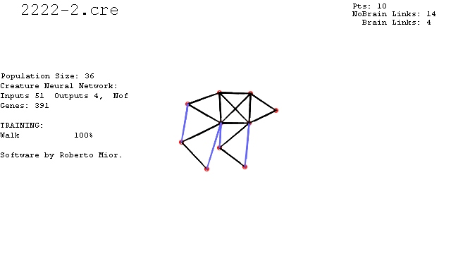



## EVOLVING Creatures V7

### Description

This is a typical example of how evolution works.

A population of (customizable) Creatures try to Evolve according to some tasks.

A Creature is composed by springs, "muscles" and a neural network.

There are "intelligent" and "dumb" springs. First ones change their rest length according to the neural network outputs. The other simply react to external forces to mantain their invariable rest lengths.

From V6 there are "muscles". Muscle is an angle constrain between two links. The NN outputs determinate

even the Angle that they must have.

The Creature's Neural Network Inputs are: Vx,Vy & "Pressure" of touching ground Points, Creature Rotation (DX and DY), Height from ground, X Y Velocities and Rotational Velocity.

The Creature's Neural Network Outputs are: "Intelligent" springs rest lengths and Muscles rest angles.

EVOLUTION (genetic algorithm):

At Each generation there are 3 sons wich parents are "randomly" choosen from the best previous generation creatures. (Some sons mutate their genes with low probability (M)).

Then sons are Evaluated. (This 3 sons replace the previous generation worst creatures)
 
### More Info
 

             |
---                |---
**Submitted On**   |2012-02-25 23:57:18
**By**             |[reexre](https://github.com/Planet-Source-Code/PSCIndex/blob/master/ByAuthor/reexre.md)
**Level**          |Intermediate
**User Rating**    |5.0 (20 globes from 4 users)
**Compatibility**  |VB 6\.0
**Category**       |[Miscellaneous](https://github.com/Planet-Source-Code/PSCIndex/blob/master/ByCategory/miscellaneous__1-1.md)
**World**          |[Visual Basic](https://github.com/Planet-Source-Code/PSCIndex/blob/master/ByWorld/visual-basic.md)
**Archive File**   |[EVOLVING\_C2220852292012\.zip](https://github.com/Planet-Source-Code/reexre-evolving-creatures-v7__1-74127/archive/master.zip)

